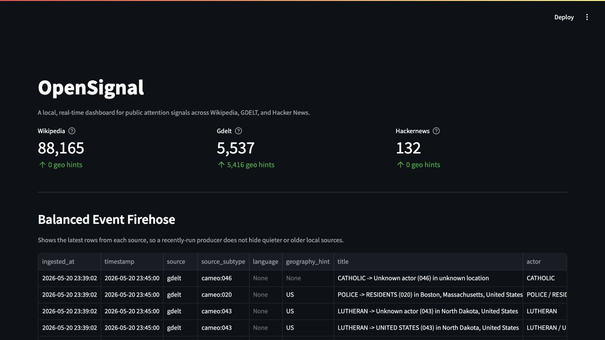

# OpenSignal

A live, multi-source dashboard that ingests open public signals and surfaces what the world is paying attention to right now.

Status: under construction.

## Local Infrastructure

Phase 1.1 brings up the local Kafka, ClickHouse, and Kafka UI services:

```bash
docker compose up -d
```

Once healthy:

- Kafka UI: http://localhost:18080
- ClickHouse HTTP: http://localhost:8123

ClickHouse smoke test:

```bash
curl "http://localhost:8123/?query=SELECT%201"
```

Note: the local Kafka and Kafka UI host ports are `19092` and `18080` to avoid common conflicts with other local Kafka stacks. Docker-internal service names remain stable.

## Wikipedia Ingestion

Phase 1.2 adds a Wikimedia recent-change producer that normalizes each event into the OpenSignal canonical schema and writes to Kafka topic `events.raw`.

Apply the ClickHouse raw-event schema:

```bash
docker compose exec -T clickhouse clickhouse-client < clickhouse/schema.sql
```

Run a short smoke test:

```bash
python -m venv .venv
. .venv/bin/activate
pip install -r requirements.txt
python -m ingestion.wikipedia_producer --max-events 100
```

For tests:

```bash
pip install -r requirements-dev.txt
pytest -q
```

Check ingested rows:

```bash
curl "http://localhost:8123/?query=SELECT%20count()%20FROM%20opensignal.events_raw%20WHERE%20source%3D%27wikipedia%27"
```

For continuous ingestion, omit `--max-events`. The producer reconnects to Wikimedia with exponential backoff and publishes malformed parse/normalization failures to `events.dlq`.

Wikipedia edit bodies are not included in the live stream. OpenSignal stores revision references (`content_id`, `parent_content_id`), the diff URL (`content_url`), and the edit comment (`content_hint`) so later workers can fetch diffs only for events worth LLM analysis.

### Phase 1.2 Soak Result

A 30-minute Wikipedia producer soak ran on 2026-05-20 from 19:46:29Z to 20:16:29Z.

- Events produced and stored: 87,845
- Observed rate: about 176K events/hour
- ClickHouse stayed current with Kafka during the run
- DLQ entries: 2, both understood stream disconnect events from Wikimedia
- Reconnect behavior: successful automatic reconnects after premature stream endings
- Content reference coverage: 46,508 rows with revision IDs, 84,149 with content URLs, 84,309 with edit comments

The live Wikimedia stream includes substantial bot and maintenance activity, especially Commons, Wikidata, and categorization events. Later trend and enrichment stages should filter or prioritize events instead of treating every raw change as equally meaningful.

## GDELT Ingestion

Phase 1.3 adds a GDELT 2.0 producer that polls `lastupdate.txt`, downloads the latest `*.export.CSV.zip`, filters low-intensity verbal cooperation events, normalizes rows into the canonical schema, and writes to `events.raw`.

```bash
python -m ingestion.gdelt_producer --once
```

Restart safety uses a local SQLite marker at `data/gdelt_state.sqlite3`, so the same export file is not reprocessed after a producer restart.

### Phase 1.3 Soak Result

The GDELT producer was validated against live `lastupdate.txt` exports on 2026-05-20.

- Current GDELT rows stored: 5,537
- Unique GDELT event IDs: 5,537
- Rows with geography hints: 5,416
- Processed export files: 5
- Total rows seen in those files: 5,851
- Rows produced after filtering: 5,537
- Rows filtered as low-intensity verbal cooperation: 314
- Restart marker behavior: verified; already processed files are skipped and not duplicated
- DLQ additions from GDELT: 0

The local machine paused during the longer poll run and later resumed; the producer continued polling and processed the latest available export without manual repair. GDELT publication timing can lag the nominal 15-minute cadence, so downstream monitoring should treat missing intervals as a normal source-side condition unless several intervals are absent.

## Hacker News Ingestion

Phase 1.4 uses Hacker News as the third Stage 1 source after Reddit's classic API setup proved too frictiony for a local portfolio build.

```bash
python -m ingestion.hackernews_producer --once
```

The producer polls the Firebase API for `top`, `new`, and `best` stories, normalizes stories into `events.raw`, and uses a local SQLite marker at `data/hackernews_state.sqlite3` to avoid duplicate ingestion. `magnitude` is `score + descendants`, so high-discussion stories sort above low-attention links.

Initial smoke test:

- Events produced and stored: 132 unique stories from 150 fetched IDs
- Duplicate prevention: second run produced 0 events and skipped 150 already-seen IDs
- DLQ additions: 0

## Stage 1 Dashboard



Apply the analytical rollups and run the dashboard:

```bash
docker compose exec -T clickhouse clickhouse-client --multiquery < clickhouse/materialized_views.sql
pip install -r dashboard/requirements.txt
streamlit run dashboard/app.py
```

Or use:

```bash
make demo
```

The dashboard includes:

- balanced event firehose, latest rows from each source
- stacked volume by source, last 24 hours
- geography hint coverage and GDELT country distribution
- top titles by source, using each source's latest available hour

Stage 1 geography note: GDELT provides country codes in the raw feed. Wikipedia and Hacker News do not provide reliable geography at ingestion time, so those are intentionally left blank until the enrichment layer extracts entities and locations.

Stage 1 quality note: the dashboard now filters obvious Wikipedia category/file maintenance in the top-title view, but raw Wikipedia still includes user pages, sandboxes, bots, and non-article edits. Stage 2 enrichment and Stage 3 correlation are where those signals become cleaner topics.

## LLM Enrichment

Stage 2 adds selected-event enrichment. The first pass intentionally enriches high-value candidates instead of the full firehose:

- GDELT events, prioritized by mention count
- Hacker News stories
- high-magnitude, article-like Wikipedia edits

Apply the enrichment schema:

```bash
docker compose exec -T clickhouse clickhouse-client --multiquery < clickhouse/enrichment_schema.sql
```

Dry-run without spending API credits:

```bash
python -m enrichment.llm_classifier --dry-run --limit 25
```

Live Anthropic run:

```bash
python -m enrichment.llm_classifier --limit 25
```

The default model is `claude-haiku-4-5-20251001`, which is the Haiku model currently visible to this Anthropic workspace. Costs are recorded in `opensignal.enrichment_costs` using Anthropic token usage and the `LLM_INPUT_PRICE_PER_MTOK` / `LLM_OUTPUT_PRICE_PER_MTOK` settings from `.env`.

## Bluesky Ingestion

Bluesky Jetstream is available as an optional experimental open social firehose source.

```bash
python -m ingestion.bluesky_producer --max-events 500
```

The producer connects to Jetstream with a collection filter for `app.bsky.feed.post`, keeps English posts by default, normalizes them into `events.raw`, and stores the post text in `content_hint` for later enrichment.

Initial smoke test:

- Events produced and stored: 200
- Unique Bluesky event IDs: 200
- DLQ additions: 0

As expected for an open social firehose, content quality is mixed. It is not the default Stage 1 source; Hacker News is the stable third source for the local dashboard.
